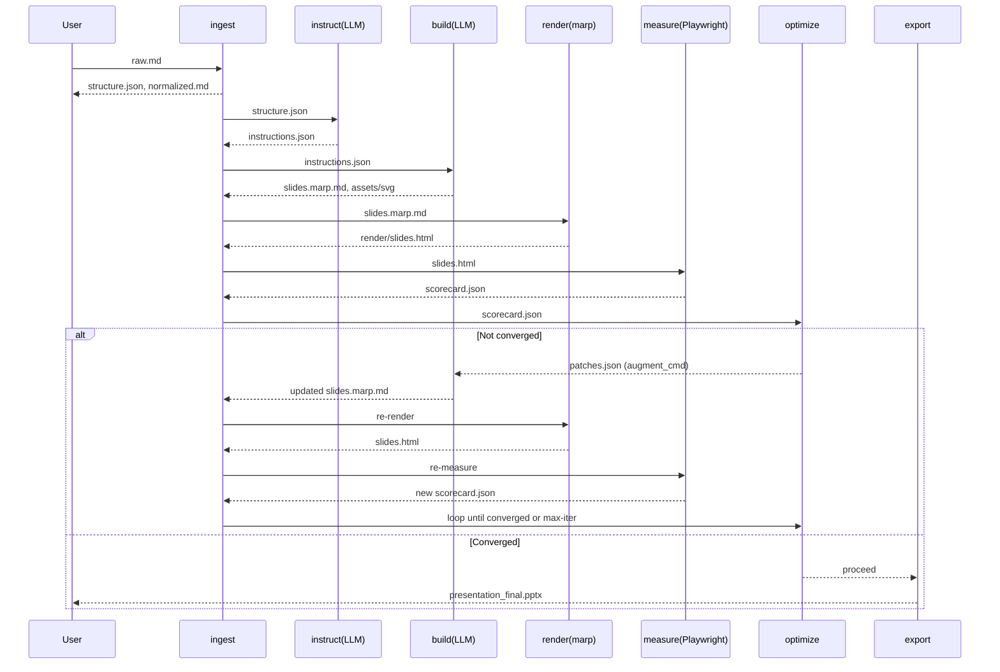

# slidectl インタフェース／情報連携仕様（Dataflow & Contracts v1.0）

## 0. 趣旨

本書は **各サブコマンド間のI/F（入力/出力）・データ形式・フロー制御**を明確化します。
運用は **ワークスペース（`--ws`）単位**で完結し、**ファイル契約（data contracts）** に従って連携します。
すべてのコマンドは **標準入出力（パイプ）** と **ファイルI/O** の両様式をサポートします。

---

## 1. 共通ルール

### 1.1 ワークスペース規約

```
<WS>/
  config/           # 設定・テンプレ
  ingest/           # 原稿正規化・構造
  instruct/         # スライド設計（LLM出力）
  build/            # Marp.md と資材
    assets/svg/
  render/           # 中間レンダリング
  optimize/         # 計測・パッチ
  report/           # CSV等
  out/              # 最終物
  .state/           # 実行ロック・実行履歴
  .logs/            # 実行ログ(JSONL)
```

### 1.2 メタ情報（`<WS>/.state/run.json`）

```json
{
  "version": "1.0",
  "created_at": "2025-11-01T15:21:00+09:00",
  "updated_at": "2025-11-01T15:23:10+09:00",
  "steps": ["ingest","instruct","build","render","measure","optimize","export"],
  "last_ok": "render",
  "iteration": 1,
  "lock": false
}
```

### 1.3 戻り値・冪等性・ロック

* **戻り値**: 0=OK, 2=入力不正, 3=外部CLI失敗, 4=レンダ失敗, 5=計測失敗, 6=未収束。
* **冪等性**: 同一入力と同一`config/`で再実行時に同一成果物。
* **ロック**: 実行中は `<WS>/.state/lock` を作成。二重起動で `exit 2`。

### 1.4 標準入出力モード

* すべてのサブコマンドは `--in -` / `--out -` で **stdin/stdout** を許可。
* **JSON Lines（.jsonl）** は複数スライドのストリーム連携時に使用。

---

## 2. サブコマンド間 I/F（入出力契約）

### 2.1 `ingest`（原稿→正規化 & 構造）

* **入力**: `--in <md>|-`（UTF-8 Markdown）
* **出力（ファイル）**

  * `<WS>/ingest/normalized.md`
  * `<WS>/ingest/structure.json`
* **structure.json（契約）**

```json
{
  "version": "1.0",
  "doc_title": "講演タイトル",
  "sections": [
    {
      "section_id": "sec-001",
      "heading": "序章",
      "slides_hint": [
        {
          "hint_id": "h-001",
          "title": "課題意識",
          "bullets": ["背景", "現状", "課題"],
          "raw_text": "…"
        }
      ]
    }
  ]
}
```

### 2.2 `instruct`（構造→設計指示／LLMブリッジ）

* **入力**: `<WS>/ingest/structure.json`
* **出力**: `<WS>/instruct/instructions.json`
* **外部CLI**: `config/policy.json.commands.instruct_cmd`
* **instructions.json（契約）**

```json
{
  "version": "1.0",
  "slides": [
    {
      "slide_id": "s-001",
      "layout": "two-column",
      "title": "AI駆動開発の全体像",
      "left": ["背景","課題","目的"],
      "right": ["効果","KPI","範囲"],
      "assets": [{"type":"svg","gen":"auto","role":"diagram"}],
      "policies": {"on_overflow":"shorten-or-split","on_whitespace":"augment-or-add-svg"},
      "notes": "冒頭で…"
    }
  ]
}
```

### 2.3 `build`（設計指示→Marp.md & SVG／LLMブリッジ）

* **入力**: `<WS>/instruct/instructions.json`
* **出力**:

  * `<WS>/build/slides.marp.md`
  * `<WS>/build/assets/svg/slide_001.svg`（0..N）
  * `<WS>/build/build.log.json`
* **外部CLI**: `config/policy.json.commands.build_cmd`
* **build.log.json（契約）**

```json
{
  "version":"1.0",
  "slides_count": 42,
  "assets": ["assets/svg/slide_001.svg","assets/svg/slide_012.svg"],
  "theme":"config/theme.css",
  "fonts":["NotoSansJP","SourceHanSansJP"]
}
```

### 2.4 `render`（Marp.md→HTML/SVG/PPTX中間）

* **入力**: `<WS>/build/slides.marp.md`
* **出力**: `<WS>/render/slides.html`（必須）、必要に応じ `<WS>/render/svg/slide_001.svg`
* **付帯**: `--theme`, `--aspect`, `--allow-local-files` を marp-cli に明示。

### 2.5 `measure`（HTML/SVG→スコア）

* **入力**: `<WS>/render/slides.html`（または `render/svg/`）
* **出力**: `<WS>/optimize/scorecard.json`
* **scorecard.json（契約）**

```json
{
  "version": "1.0",
  "thresholds": {
    "density": [0.012, 0.018],
    "whitespace": [0.15, 0.40]
  },
  "slides": [
    {
      "slide_id": "s-001",
      "page_index": 1,
      "density": 0.0142,
      "whitespace_ratio": 0.27,
      "overlaps": 0,
      "warnings": []
    }
  ]
}
```

### 2.6 `optimize`（スコア→パッチ→再ビルド制御）

* **入力**: `<WS>/optimize/scorecard.json`
* **出力**:

  * `<WS>/optimize/patches.json`（NG時）
  * `<WS>/report/slide_quality_report.csv`（収束時）
* **外部CLI**: `config/policy.json.commands.augment_cmd`
* **patches.json（契約）**

```json
{
  "version": "1.0",
  "iteration": 2,
  "patches": [
    {
      "slide_id": "s-018",
      "reason": "whitespace_high",
      "actions": [
        {"type":"augment_text","section":"bullets","insert":["背景を1行追加","効果1行","次アクション1行"]},
        {"type":"add_svg","role":"timeline","keywords":["As-Is","To-Be","Milestones"]}
      ]
    },
    {
      "slide_id": "s-005",
      "reason": "density_high",
      "actions": [
        {"type":"shorten","section":"bullets","limit_per_item":18},
        {"type":"split_slide","suffix":"b"}
      ]
    }
  ]
}
```

### 2.7 `export`（最終PPTX）

* **入力**: `<WS>/build/slides.marp.md`
* **出力**: `<WS>/out/presentation_final.pptx`
* **注記**: 収束後のみ実行可（`scorecard.json` 合格 or `optimize` exit=0）。

### 2.8 `status`（状態集約）

* **入力**: `<WS>/.state/*`, 直近成果物
* **出力**: テキスト or `--json` 構造化

```json
{
  "workspace": "/path/ws",
  "steps": {
    "ingest":"ok",
    "instruct":"ok",
    "build":"ok",
    "render":"ok",
    "measure":"ok",
    "optimize":{"status":"ok","iteration":2},
    "export":"pending"
  },
  "latest": {
    "slides": 42,
    "density_ok_ratio": 0.97,
    "whitespace_ok_ratio": 0.96,
    "overlaps_total": 0
  }
}
```

---

## 3. データフロー（順方向 & 反復）

### 3.1 全体シーケンス



### 3.2 反復収束ループ（状態機械）

```
MEASURE -> (OK?) -> EXPORT
         -> (NG)  -> OPTIMIZE -> AUGMENT(build) -> RENDER -> MEASURE
                    (iteration++ , stop if >= max_iter)
```

---

## 4. 情報連携の詳細仕様

### 4.1 スライドID規約

* `s-001`, `s-002` … 昇順連番。分割時は `s-005a`, `s-005b`。
* すべての JSON/CSV/MD で **同一ID** をキーに整合させる。

### 4.2 文字密度・余白の算出（計測I/F）

* **対象要素**: `<svg>` 内の `text`, `tspan`, `foreignObject`。
* **density** = `Σ(bbox_w * bbox_h) / slide_area`
* **union 面積**: スイープライン近似。重なりは **別途 overlaps** でカウント。
* **whitespace_ratio** = `1 - union_area / slide_area`
* **overlaps**: BBox 交差ペア数（閾値>1pxでカウント）

### 4.3 指標の許容範囲（`config/policy.json`）

```json
{
  "density_range": [0.012, 0.018],
  "whitespace_range": [0.15, 0.40],
  "max_iterations": 3,
  "commands": {
    "instruct_cmd": "claude-cli ...",
    "build_cmd": "claude-cli ...",
    "augment_cmd": "claude-cli ..."
  }
}
```

### 4.4 CSVレポート（`report/slide_quality_report.csv`）

```
slide_id,page_index,density,whitespace_ratio,overlaps,status,notes
s-001,1,0.0142,0.27,0,OK,
s-018,18,0.0079,0.46,0,Augmented,added timeline svg
...
```

---

## 5. エラーモデル & リトライ

| 失敗点            | 原因例             | 振る舞い                          |
| -------------- | --------------- | ----------------------------- |
| ingest         | 文字コード不正         | exit 2 / 正規化前で停止              |
| instruct/build | 外部CLI失敗         | exit 3 / 再実行で回復               |
| render         | marp-cli エラー    | exit 4 / テーマ・MD検証へ誘導          |
| measure        | Playwright起動不可  | exit 5 / Chromium再インストール      |
| optimize       | 収束不能（max-iter超） | exit 6 / patches.json で人手修正促す |

* **再実行時の粒度**: 可能なら該当ステップのみ再実行。
* **ロギング**: `<WS>/.logs/<step>.jsonl` に時系列蓄積。

---

## 6. 標準入出力（パイプ）例

### 6.1 ingest→instruct→build（ストリーム）

```bash
cat doc/raw.md \
| slidectl ingest --ws ws --in - --out - \
| slidectl instruct --ws ws --in - --out - \
| slidectl build    --ws ws --in - --out -
```

* `ingest --out -` は **structure.json** を stdout に出す。
* 以下同様に JSON をパイプで連携（ファイルも同時に ws に保存）。

### 6.2 measure→optimize（合否のみ標準出力）

```bash
slidectl measure  --ws ws --json | jq '.summary'
slidectl optimize --ws ws --max-iter 3 --json | jq '.result'
```

---

## 7. 互換性・バージョニング

* すべてのJSONには `version` フィールドを含め、**後方互換で拡張**（未知キーは無視）。
* `slidectl --migrate` で古い `version` からのスキーマ更新を提供（将来）。

---

## 8. 外部CLIブリッジ契約

* **環境変数注入**: `SLIDECTL_WS`, `SLIDECTL_ITER`, `SLIDECTL_POLICY_PATH`。
* **テンプレ置換**: `@ingest/structure.json` / `@instruct/instructions.json` / `@optimize/patches.json` は WS ルート相対解決。
* **戻り値**: 0 以外は `slidectl` が exit 3 として扱う。
* **出力**: 指定ファイルに書き出すこと（stdout はログ扱い）。

---

## 9. セキュリティ／整合性

* SVGは `xmlns` と `viewBox` 必須。外部URL画像は拒否（`allow-local-files` のみ）。
* 相対パスのみ許可（`../../` などの脱出は検知し失敗）。
* フォントはテーマで固定（Noto Sans JP 系）。
* 生成ファイルの SHA256 を `.state/checksums.json` に保持（差分検知）。

---

## 10. 参考：最小コマンド列（ファイルI/Fのみ）

```bash
slidectl ingest   --ws ws --in doc/raw.md
slidectl instruct --ws ws
slidectl build    --ws ws
slidectl render   --ws ws
slidectl measure  --ws ws
slidectl optimize --ws ws --max-iter 3
slidectl export   --ws ws --pptx-name talk_2025.pptx
```

---

必要であれば、この契約に沿った **サンプル`instructions.json`/`scorecard.json`/`patches.json`** の実ファイル雛形や、**`report.csv` 出力テンプレ**も用意します。
