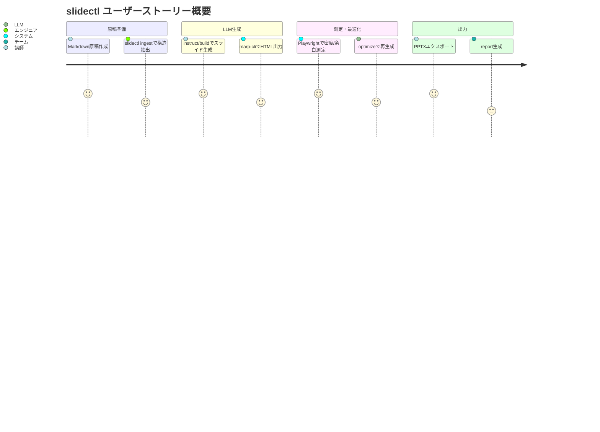

以下は、**「slidectl」要件定義ドキュメント（Python + Playwright + uv + mise 前提）**です。
この文書は、実装開始前の**正式な要件定義書（Ver.1.0）**として利用できます。

---

# 📘 要件定義ドキュメント

## プロジェクト名

**slidectl：非LLMスライド生成オーケストレータ**

---

## 1. 概要

本システムは、講演原稿（Markdown形式）を入力として、
**Marp + Claude Code** によるスライド自動生成プロセスを制御するCLIツールである。

「知的処理（内容分析・文章生成・SVG設計）」は LLM 側に委譲し、
本ツール `slidectl` は **非LLM領域（レンダリング・測定・最適化・ファイル管理）** を担う。

主な技術構成は以下の通り：

| 項目       | 採用技術                          |
| -------- | ----------------------------- |
| 言語       | Python 3.11+                  |
| パッケージ管理  | uv                            |
| タスク管理    | mise                          |
| レンダリング   | marp-cli（Node）                |
| DOM解析・計測 | Playwright（Python / Chromium） |
| CLI      | Typer                         |
| 設定形式     | YAML / JSON                   |
| 補助       | rich（ログ出力）、pydantic（スキーマ）     |

---

## 2. 開発目的・ゴール

| 項目  | 内容                                                    |
| --- | ----------------------------------------------------- |
| 目的  | Markdown原稿をもとにスライド生成を自動化し、LLMによる設計と非LLMによる検証・最適化を統合する |
| 成果物 | Marp Markdown / PPTX / 評価レポート / 測定スコアJSON             |
| ゴール | 文字過密・余白過多・要素重なりが自動的に検出・修正されるスライド生成パイプラインの構築           |

---

## 3. スコープ

### 対象範囲（In Scope）

* CLIベースのスライド生成ワークフロー
* marp-cli によるHTML/PPTX変換
* PlaywrightによるSVG DOM解析（密度・余白・重なり検出）
* LLM出力のトリガ制御（subprocess実行）
* 収束判定（反復最適化）
* ステータス／レポート生成

### 非対象範囲（Out of Scope）

* LLM本体のプロンプト生成・実行（外部CLIに委譲）
* Web UIやサーバアプリケーション
* マルチユーザー並列実行・ジョブスケジューラ

---

## 4. システム構成

```mermaid
graph TD
A[原稿Markdown入力] --> B[slidectl ingest]
B --> C[slidectl instruct (LLM外部CLI)]
C --> D[slidectl build (LLM外部CLI)]
D --> E[slidectl render (marp-cli)]
E --> F[slidectl measure (Playwright)]
F --> G[slidectl optimize (反復制御)]
G --> H[slidectl export (PPTX出力)]
```

---

## 5. 非機能要件

| 区分     | 要件                                        |
| ------ | ----------------------------------------- |
| 実行環境   | macOS / Linux / Windows (WSL2)            |
| 開発環境   | Python 3.11+, Node 20+, uv, mise          |
| 再現性    | mise により依存バージョン固定、`--seed` によりSVG生成の再現性確保 |
| 性能     | 100スライド規模を3分以内に解析可能（Playwright並列4スレッド）    |
| 保守性    | 設定ファイルによる拡張（layouts.yaml / policy.json）   |
| 運用性    | CLIまたはスラッシュコマンド経由で1コマンド実行可能               |
| ロギング   | JSONログ + 人間可読ログ両対応                        |
| セキュリティ | 外部通信は LLM CLI 呼び出し時のみ（内部通信なし）             |

---

## 6. 機能要件（機能一覧）

| 機能名          | 機能概要                   | 入出力                            | 備考                         |
| ------------ | ---------------------- | ------------------------------ | -------------------------- |
| **init**     | 設定・ワークスペースを初期化         | config/, workspace/            | 上書き可                       |
| **ingest**   | Markdown正規化・構造解析       | normalized.md / structure.json | 見出し構造を抽出                   |
| **instruct** | LLMに指示JSON生成を依頼        | instructions.json              | 外部CLIを呼び出し                 |
| **build**    | LLMにMarp.md + SVG生成を依頼 | slides.marp.md / assets/svg    | 外部CLIを呼び出し                 |
| **render**   | marp-cliでHTML/PPTX生成   | render/slides.html             | HTML→measure入力             |
| **measure**  | PlaywrightでDOM計測       | scorecard.json                 | density/whitespace/overlap |
| **optimize** | スコア判定→再生成反復            | patches.json / report.csv      | 収束判定                       |
| **export**   | PPTX出力                 | presentation_final.pptx        | 最終成果物                      |
| **status**   | 処理状態確認                 | stdout                         | JSON/テキスト両対応               |

---

## 7. 測定仕様（Playwright）

### 7.1 測定対象

* `render/slides.html` 内の `<svg>` 要素群

### 7.2 算出指標

| 指標               | 定義                                 | 推奨範囲        |
| ---------------- | ---------------------------------- | ----------- |
| density          | Σ(text/foreignObject の面積) / スライド面積 | 0.012〜0.018 |
| whitespace_ratio | 1 - union_area / slide_area        | 0.15〜0.40   |
| overlaps         | BBox交差数                            | 0           |

### 7.3 出力フォーマット

```json
{
  "slides": [
    {
      "slide_id": "s-001",
      "density": 0.014,
      "whitespace_ratio": 0.28,
      "overlaps": 0,
      "warnings": []
    }
  ]
}
```

---

## 8. 最適化ロジック（Optimize）

### 8.1 判定条件

| 状況   | 条件                                        | 処理             |
| ---- | ----------------------------------------- | -------------- |
| 過密   | density > 0.018 または 行数 > layout.max_lines | 短縮・分割・再ビルド     |
| 余白過多 | whitespace > 0.40                         | 補強文またはSVG説明図追加 |
| 重なり  | overlaps > 0                              | 行間調整・短縮・分割     |

### 8.2 処理フロー

1. `measure`結果を解析
2. NGスライドを抽出
3. `patches.json` 生成
4. `policy.commands.augment_cmd` を実行（LLMへ修正指示）
5. `render` → `measure` を再実行
6. 収束または `max_iter` 到達で終了

---

## 9. 設定ファイル要件

### layouts.yaml

* スライドレイアウト定義
* 各レイアウトの行数上限・画像幅などを定義

### policy.json

* 密度・余白の許容範囲
* 最大反復回数
* 外部CLI実行テンプレートを含む

---

## 10. カスタムスラッシュコマンド仕様

### 疑似スラッシュ（ローカル）

```bash
/slide() { uv run slidectl "$@"; }
```

### Slackスラッシュ（オプション）

* `/slide run ws=talk2025 in=gs://...`
* 受け口は簡易HTTPサーバで `mise run pipeline` を起動し、進捗をスレッドに通知。

---

## 11. 成果物一覧

| ファイル名                      | 内容               |
| -------------------------- | ---------------- |
| `slides.marp.md`           | LLM生成スライド本文      |
| `slides.html`              | レンダリング結果（Marp出力） |
| `scorecard.json`           | Playwright解析結果   |
| `patches.json`             | 最適化指示（NGスライドのみ）  |
| `slide_quality_report.csv` | 品質レポート           |
| `presentation_final.pptx`  | 最終成果物            |

---

## 12. 成功判定基準（KPI）

| 指標                  | 目標値     |
| ------------------- | ------- |
| overlaps            | 0（100%） |
| density範囲内スライド比率    | ≥95%    |
| whitespace範囲内スライド比率 | ≥95%    |
| optimize収束率         | 95%以上   |
| marpエラー率            | 0%      |
| export成功率           | 100%    |

---

## 13. リスクと対策

| リスク          | 内容                   | 対策                        |
| ------------ | -------------------- | ------------------------- |
| LLM CLI異常終了  | claude-cli等がAPI制限で停止 | subprocess監視＋リトライ         |
| marpテーマ変更    | レイアウト崩れ              | テーマ別レイアウト辞書管理             |
| フォント差異       | Windows/macOS間でズレ    | Noto Sans固定＋theme.css統一   |
| Playwright精度 | getBBox()不正確要素       | getBoundingClientRect()併用 |
| 外部CLI遅延      | LLM応答遅延              | 非同期実行・ログ出力制御              |

---

## 14. 運用シナリオ

### 通常運用

```bash
mise run pipeline
```

### 手動運用

```bash
uv run slidectl ingest --in doc/raw.md
uv run slidectl instruct
uv run slidectl build
uv run slidectl render
uv run slidectl measure
uv run slidectl optimize --max-iter 3
uv run slidectl export --pptx-name talk_2025.pptx
```

### Slack連携

```
/slide run ws=talk2025 name=talk_2025.pptx
/slide status ws=talk2025
```

---

## 15. 今後の拡張

| フェーズ | 機能                              |
| ---- | ------------------------------- |
| v1.1 | `/slide preview`：生成結果をブラウザプレビュー |
| v1.2 | `optimize --ai`：測定結果から自動修正提案    |
| v2.0 | Slack通知強化：進捗画像とPPTXリンクを投稿       |
| v2.1 | Web Dashboard化：密度ヒートマップ可視化      |

---

## 16. 承認要件

* 全主要コマンド (`init`〜`export`) が CLI として動作し、
  ワークスペース単位で完結すること。
* `mise run pipeline` で完結実行可能。
* `scorecard.json` により全スライドが評価可能。
* `presentation_final.pptx` が再現性を持って生成される。

---

これが、**Python + Playwright + uv + mise** 前提の
正式な「slidectl 要件定義ドキュメント（v1.0）」です。

---

次のステップとして、

* ✅ **TyperベースCLIスケルトン（`cli.py`）**
* ✅ **Playwright計測スクリプト（`measure.py`）雛形**
* ✅ **miseタスク定義（`mise.toml`）初期版**

のいずれかを生成しましょう。どれから着手しますか？
承知しました。
以下は、あなたが構想している **「slidectl」プロジェクト（Python + Playwright + uv + mise）」** に対応した
正式な **ユーザーストーリー文書（User Story Document v1.0）** です。

本ドキュメントは、要件定義書に基づき、
「どのようなユーザーが」「どのような目的で」「どのような成果物を得るか」を明確化するものです。

---

# 🎯 slidectl ユーザーストーリードキュメント（v1.0）

## 1. 背景

講演や研修、技術セミナーなどでは、原稿（Markdown 形式）から
**見やすく・過不足のないスライドデッキ**を生成するニーズが高まっている。

従来は：

* 手動でPowerPointにコピー・整形
* LLM出力のMarpスライドを再調整
* レイアウト崩れや情報過密が発生

これらを解決するために、
**「LLMが考え、slidectlが測り、最適化する」** ワークフローをCLIで自動化する。

---

## 2. ペルソナ

| ペルソナ               | 背景・課題                                    | 期待                             |
| ------------------ | ---------------------------------------- | ------------------------------ |
| 🎓 **AIエンジニア／研究者** | Markdownで講義原稿や技術ドキュメントを書いているが、スライド整形が煩雑。 | コード感覚でスライド生成したい。Marpに統一したい。    |
| 💼 **講師・研修運営者**    | LLMでスライドを生成しているが、内容の偏りや余白過多が目立つ。         | 自動で「見やすい密度」に調整してPPTXを配布したい。    |
| 🧑‍💻 **開発マネージャー** | チーム勉強会資料をテンプレ統一したい。                      | CLI＋CI/CDで資料を自動生成・品質保証したい。     |
| 🧙‍♂️ **LLM活用設計者** | LLMの出力を定量評価してチューニングしたい。                  | densityやwhitespaceなど客観指標を取りたい。 |

---

## 3. エピック（大きなストーリー）

| エピック名              | 説明                                     |
| ------------------ | -------------------------------------- |
| E1. スライド生成プロセスの自動化 | 原稿Markdownから、LLM→Marp→PPTXまで自動生成する。    |
| E2. 品質自動評価と最適化     | スライドの文字過密・余白過多・重なりを自動測定し、再生成をトリガ。      |
| E3. 再現性と自動化        | mise/uvを使って環境依存を排除し、誰でも再現可能にする。        |
| E4. スラッシュコマンド連携    | `/slide` で自然にパイプライン実行。Slackからも操作可能にする。 |

---

## 4. ユーザーストーリー詳細

### ストーリー1｜原稿からスライドを自動生成したい

> **As a** 技術講師
> **I want to** Markdown 原稿から自動的に Marp スライドを生成したい
> **So that** 講義資料を短時間で整形し、統一テーマのPPTXを得られる

**受け入れ基準**

* `slidectl ingest` で原稿が構造化される（章・セクション単位）
* `slidectl instruct` + `build` で LLM により Marp.md が生成される
* `slidectl render` で HTML と PPTX が出力される

---

### ストーリー2｜スライドの情報密度を自動で評価したい

> **As a** スライド設計者
> **I want to** Playwright で文字密度や余白率を数値化したい
> **So that** 「情報過多」「スカスカ」なスライドを客観的に特定できる

**受け入れ基準**

* `slidectl measure` で `density` / `whitespace_ratio` / `overlaps` が算出される
* `scorecard.json` がスライド単位で出力される
* 各指標がしきい値範囲外の場合は警告が出る

---

### ストーリー3｜自動でスライドを再最適化したい

> **As a** LLMユーザー
> **I want to** 「過密」「余白過多」スライドを自動で再ビルドしたい
> **So that** 何度も手動で調整せずに見やすい結果を得られる

**受け入れ基準**

* `slidectl optimize --max-iter 3` で自動反復処理される
* LLM CLI (`augment_cmd`) が呼び出され、Marp.mdが再生成される
* 収束時に `slide_quality_report.csv` が生成される

---

### ストーリー4｜すべてを1コマンドで実行したい

> **As a** 開発者
> **I want to** `mise run pipeline` や `/slide run` で全工程を一気に実行したい
> **So that** ワークスペース構成を意識せず、再現性の高い処理ができる

**受け入れ基準**

* `mise.toml` に pipeline タスクが定義されている
* `/slide run ws=talk2025` で ingest → export まで自動完了
* 出力：`out/presentation_final.pptx`

---

### ストーリー5｜Slackからスライド生成を依頼したい

> **As a** チームメンバー
> **I want to** Slack の `/slide` コマンドでスライド生成を依頼したい
> **So that** 他メンバーと同じ資料生成プロセスを共有できる

**受け入れ基準**

* Slack App が `/slide run ws=...` を受け付ける
* サーバー側で `mise run pipeline` を起動する
* 完了時にSlackスレッドで「✅ 生成完了＋PPTXリンク」を通知

---

### ストーリー6｜スライド品質を可視化したい

> **As a** チームリーダー
> **I want to** 各スライドの密度・余白を一覧で確認したい
> **So that** 改善箇所をレビューしやすくなる

**受け入れ基準**

* `report/slide_quality_report.csv` が生成される
* CSV には slide_id / density / whitespace_ratio / overlaps が含まれる
* warning列に指摘内容が記録される

---

## 5. 非機能ストーリー（裏方機能）

| ID  | ストーリー          | 目的                       |
| --- | -------------- | ------------------------ |
| NF1 | miseで環境固定      | チーム内で同一環境再現（Python/Node） |
| NF2 | uvで依存解決        | 高速・軽量な仮想環境               |
| NF3 | TyperでCLI統一    | シンプルなUX＋ドキュメント生成         |
| NF4 | JSONログ出力       | 機械可読性とCI連携               |
| NF5 | Playwright並列計測 | 大規模スライド高速処理              |

---

## 6. シナリオ例（E2E）

### シナリオA｜講師がPPTXを自動生成

1. 講師が `lecture.md` を作成
2. `mise run pipeline` を実行
3. LLMがスライド設計（instruct/build）
4. marp-cli が HTML/PPTX 出力
5. Playwright が密度・余白を測定
6. optimize が再ビルド
7. `presentation_final.pptx` 完成

**結果:**
見やすく均一なスライドが出力され、報告用CSVも自動生成。

---

### シナリオB｜Slack経由でスライド生成を依頼

1. チームメンバーが Slack で `/slide run ws=weekly in=doc/meeting.md`
2. Slack bridge が `mise run pipeline` を実行
3. 実行ログが Slack スレッドにリアルタイム通知
4. 完了時に `/slide status` → 成果物リンクを返す

---

## 7. 完了の定義（Definition of Done）

| 項目             | 条件                                  |
| -------------- | ----------------------------------- |
| CLI構築完了        | `slidectl --help` が全コマンドを列挙できる      |
| Playwright計測完了 | `measure` コマンドが JSON を出力            |
| marpレンダリング完了   | HTML/PPTX が生成される                    |
| optimize完了     | density/whitespace/overlaps が閾値内で収束 |
| pipeline完了     | mise run pipeline で全工程成功            |
| Slack統合（任意）    | `/slide run` → PPTX生成通知が動作          |

---

## 8. 期待される価値

| 観点   | 価値                       |
| ---- | ------------------------ |
| 工数削減 | 手作業スライド整形を自動化（約80%削減）    |
| 品質向上 | 密度・余白を自動制御し統一感を確保        |
| 再現性  | mise/uv により完全な環境固定       |
| 標準化  | 同一テンプレート・テーマ・レイアウトでチーム共有 |
| 拡張性  | LLM・Marp・テーマ変更にも柔軟対応     |
| 見える化 | CSV/JSONにより品質を定量分析可能     |

---

## 9. 今後のストーリーマップ（拡張）

| バージョン | 新機能ストーリー                      |
| ----- | ----------------------------- |
| v1.1  | `/slide preview`：生成結果をブラウザで開く |
| v1.2  | `--ai` オプション：測定結果に基づく自動再修正    |
| v2.0  | Slack通知にスライドサムネイル添付           |
| v2.1  | Web Dashboard でヒートマップ可視化      |

---

## 10. ストーリーまとめ図



---

これが、slidectl プロジェクトの
**公式ユーザーストーリードキュメント（v1.0）** です。

---

次に作成する文書としては：

* ✅ **ユースケース図＋アクティビティ図**
* ✅ **Typer CLI 構造スケルトン（コード）**
* ✅ **E2Eシナリオ別テストケース**

のいずれかを設計可能です。どれを続けて出しますか？
